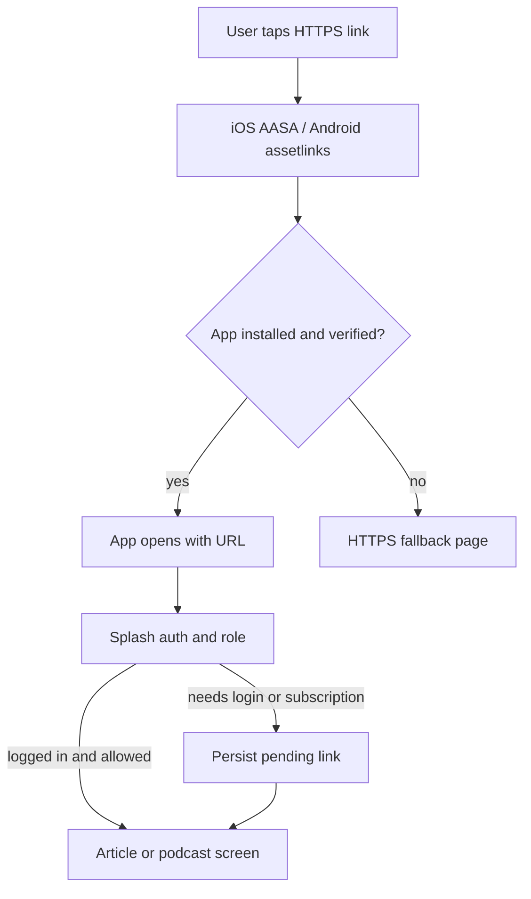

# Deep linking for articles and podcasts

Shared implementation contract for **admin**, **backend**, and **mobile app**. Copy this file into the backend/admin repo as the source of truth for URLs, AASA, App Links, APIs, and edge cases.

---

## Current state (mobile app)

The mobile app already has pieces, but they do not open content:

- Custom scheme `empowered://` exists in `ios/Empowered/Info.plist`.
- React Navigation prefixes include `empowered://` and `https://admin.empoweredhealth.asia` in `src/navigation/index.tsx`, but the config only lists auth screens. Article/podcast paths are missing. `Linking.getInitialURL()` is logged and never consumed.
- Android `android/app/src/main/AndroidManifest.xml` has `singleTask` (good) but **no** `VIEW` / `BROWSABLE` / `autoVerify` intent-filter.
- iOS `ios/Empowered/Empowered.entitlements` has **no** `applinks` associated domain.
- Articles already open via push as `KnowledgeSessionDetail` + `know_ses_id` (see Splash and Notification handlers).
- Podcasts in the staff UI are the **Podcast** tab, which is `VideoContent` → `src/screens/VideoScreen/index.tsx` with `route.params.id`.

**Content mapping used in this plan**

- **Article** → knowledge session / article detail (`know_ses_id`, API `POST /knowledge-session-details`).
- **Podcast** → video/podcast player (`id`, API video detail used by `VideoScreen`).

If admin later stores podcasts as a separate table, keep the same public URL shape and resolve type on the backend.

**Identity**

- Bundle / application ID: `asia.empoweredhealth`
- Apple Team ID (from Xcode): `R8V8Y45CQZ`
- Domain already used by the app: `admin.empoweredhealth.asia`
- API base: `https://admin.empoweredhealth.asia/api`

---

## URL contract (shared by admin, backend, app)

Use a dedicated public path prefix so links do not collide with Laravel admin routes (`/login`, `/dashboard`, etc.).

| Content | Canonical HTTPS URL | Custom-scheme fallback |
| --- | --- | --- |
| Article | `https://admin.empoweredhealth.asia/d/article/{id}` | `empowered://article/{id}` |
| Podcast | `https://admin.empoweredhealth.asia/d/podcast/{id}` | `empowered://podcast/{id}` |

Rules:

- `{id}` is the numeric primary key already used by the app APIs (stable, matches push payloads).
- Optional later: `?lang=en|cn` (app already stores language in AsyncStorage).
- Do **not** put auth tokens in the URL.
- Admin “Copy link” always copies the HTTPS URL (Universal / App Link). Custom scheme is only a debug/fallback.



---

## Backend

Host files and HTML **on the same host** as the link (`admin.empoweredhealth.asia`). Serve them **without auth, without HTML wrapping, without extra redirects** (HTTPS is required; a 301 from `https://…/.well-known/…` to a login page will break verification).

### 1. Apple App Site Association (AASA)

Serve **both**:

- `https://admin.empoweredhealth.asia/.well-known/apple-app-site-association`
- `https://admin.empoweredhealth.asia/apple-app-site-association`

`Content-Type: application/json` (Apple also accepts `application/pkcs7-mime`). **No `.json` extension.**

```json
{
  "applinks": {
    "details": [
      {
        "appIDs": ["R8V8Y45CQZ.asia.empoweredhealth"],
        "components": [
          { "/": "/d/article/*", "comment": "Articles" },
          { "/": "/d/podcast/*", "comment": "Podcasts" }
        ]
      }
    ]
  }
}
```

Confirm Team ID in Apple Developer if `R8V8Y45CQZ` is not the production team.

### 2. Android Digital Asset Links

Serve `https://admin.empoweredhealth.asia/.well-known/assetlinks.json`:

```json
[
  {
    "relation": ["delegate_permission/common.handle_all_urls"],
    "target": {
      "namespace": "android_app",
      "package_name": "asia.empoweredhealth",
      "sha256_cert_fingerprints": [
        "DEBUG_KEYSTORE_SHA256",
        "UPLOAD_KEYSTORE_SHA256",
        "PLAY_APP_SIGNING_SHA256"
      ]
    }
  }
]
```

Must include **Play App Signing** SHA-256 from Play Console (not only local `release.keystore`), plus debug fingerprint if you want `yarn android` verification.

### 3. Web fallback pages (app not installed)

For `/d/article/{id}` and `/d/podcast/{id}`:

- If content is **published** and public-previewable: render a lightweight page (title, banner, description, Open Graph tags, “Open in app” using the same HTTPS URL, store badges).
- If **draft / unpublished / deleted**: 404 or “no longer available” (do not leak titles of private drafts).
- If **role-gated or premium**: still show a teaser + CTA to install/login/subscribe; do not dump full body on the web unless product requires it.

OG tags matter for WhatsApp/iMessage previews.

### 4. Resolve API (recommended)

Add something like `GET /api/deeplink/resolve?type=article|podcast&id=123` (auth optional for metadata, required for full payload):

Return:

- `status`: `ok` | `not_found` | `unpublished` | `forbidden_role` | `subscription_required`
- `type`, `id`, `title`, `user_type` (`parent` | `child` | `staff` / `all`)
- `canonical_url`

This lets the app decide destination **before** navigating, instead of landing on a blank detail screen.

Existing detail endpoints stay as the source of truth (`/knowledge-session-details`, video detail). Extend them to return a consistent `404`/`403` for unpublished and wrong-audience items.

### 5. Share URL generation

When admin publishes an article or podcast, persist:

- `canonical_url` (HTTPS)
- `slug` optional later

Expose `canonical_url` on list/detail admin APIs so the copy button is not hand-built in three places.

### 6. Laravel / nginx gotchas

- Exclude `/.well-known/*` from SPA fallback and from `auth` middleware.
- Disable CSRF on those GET routes.
- Ensure CDN/cache does not serve `text/html`.
- AASA payload should stay under Apple’s size limits (keep path list small).
- After changing AASA, Apple caches; use the [Apple CDN debug](https://app-site-association.cdn-apple.com/a/v1/admin.empoweredhealth.asia) and bump by waiting / new devices.
- **Do not** place a static `public/.well-known/apple-app-site-association` with `"paths": ["*"]`. Laravel serves a scoped AASA from `routes/deeplink.php`. A wildcard file would steal every admin URL.
- Production nginx must pass `/.well-known/*` and `/d/*` to PHP (no auth, no HTML SPA fallback). Example:

```nginx
location ^~ /.well-known/ {
    try_files $uri /index.php?$query_string;
    add_header Content-Type application/json;
}
location ^~ /d/ {
    try_files $uri /index.php?$query_string;
}
```

- Set `DEEPLINK_PUBLIC_BASE_URL=https://admin.empoweredhealth.asia` in production so Copy link matches the associated domain even if `APP_URL` differs.
- Set `DEEPLINK_ANDROID_SHA256` to a comma-separated list of debug + upload + Play App Signing fingerprints.

---

## Admin panel

On create/edit for articles and podcasts:

- **Share** section after save: canonical HTTPS link, Copy, optional QR.
- Show verification status only as docs (“links work after publish”).
- **Publish** is the gate: unpublished items keep a URL but backend resolve returns `unpublished`.
- Audience field (`parent` / `child` / `staff` / `all`) must be set; the app uses it for stack routing.
- Optional: “Open in app” test using the custom scheme on a device with the debug build.
- Push notifications for `add_article` / video should include the **same** `id` and, if possible, a `link` field equal to `canonical_url` so push and share behave identically.

Do not generate one-off short domains unless you also host AASA there (every linked host needs its own AASA/assetlinks).

---

## Mobile app

### Native configuration

**iOS** — `ios/Empowered/Empowered.entitlements`:

```xml
<key>com.apple.developer.associated-domains</key>
<array>
  <string>applinks:admin.empoweredhealth.asia</string>
</array>
```

Enable Associated Domains on the App ID in Apple Developer. For debug, you may add `?mode=developer` only on the debug entitlement, not production.

Keep existing `empowered` URL scheme.

**Android** — add a second intent-filter on `MainActivity` in `android/app/src/main/AndroidManifest.xml`:

- `android:autoVerify="true"`
- `VIEW` + `DEFAULT` + `BROWSABLE`
- `https` + host `admin.empoweredhealth.asia`
- path prefixes `/d/article` and `/d/podcast`
- Optional extra filter for `empowered` scheme (`android:scheme="empowered"`)

`launchMode="singleTask"` already matches React Native deep-link guidance.

Rebuild native apps after these changes (not Metro-only).

### Linking architecture (do not rely on incomplete `linking.config`)

React Navigation’s current `linking` object cannot express:

- Splash-first auth
- Parent vs Teacher vs Child stacks
- Parent subscription gate in Splash

**Recommended approach:** a small dedicated module, e.g. `src/utils/services/DeepLinkService.ts`, plus a pending-link key in `src/utils/helper/SharedPreference.ts`.

1. Parse URL (`https` or `empowered://`) → `{ type: 'article' | 'podcast', id: number }`.
2. Ignore unknown hosts/paths.
3. Persist pending payload immediately (`PENDING_DEEP_LINK`).
4. After Splash finishes role routing (replace `Parent_AppStack` / `Teacher_AppStack` / `Child_AppStack` / `AuthStack` / `NewSubscription`), consume the pending link.
5. Subscribe to `Linking.addEventListener('url')` for warm start (app already open).

Wire consumption at the **end** of successful Splash navigation in `src/screens/Splash/index.tsx` (today this is where role + subscription is decided). Also consume after login / OTP / subscription success.

Destination mapping:

- Article, parent/teacher stack: `KnowledgeSessionDetail` `{ know_ses_id: id }`
- Article, child stack: same screen exists on `src/navigation/App/ChildStack.tsx`
- Podcast: `VideoScreen` `{ id }` (and for child, `ChildVideoContent` only if you must land on a list first; prefer opening the player directly)

Call `globalNavigation.navigate` **after** `replace` of the app stack (short `requestAnimationFrame` / `InteractionManager.runAfterInteractions` to avoid racing Splash).

Extend `src/navigation/index.tsx` prefixes only if you still want RN to claim the URL; **do not** add nested `screens` for content until auth is solved, or RN will try to open `KnowledgeSessionDetail` while the user is still on Splash.

### Share from inside the app

On article and video detail, add Copy/Share using `canonical_url` from API or built as `` `${STATIC_SCREEN_URL}d/article/${id}` `` from `src/utils/resources/config.ts`. Use `react-native-share` (already a dependency).

---

## Edge cases (must handle)

**Auth and session**

- Cold start with no token: keep pending link, send to `AuthStack`, apply after login (parent/teacher/child).
- Expired token: Splash already clears storage; pending link must survive `clearAllData` (store pending link **after** clear, or exclude that key from wipe).
- Parent logged in, subscription expired: Splash goes to `NewSubscription`; apply link only after active subscription (or show paywall with “continue to content”).
- Child expired: today Splash logs the child out. Either keep pending link through re-login, or show a dedicated expired screen instead of wiping.

**Roles and audience**

- Child opens a parent-only article → snackbar + home, do not show parent HTML.
- Parent/staff opens child-only video → same.
- Staff (`Teacher_AppStack`) vs parent: both have `KnowledgeSessionDetail` and `VideoScreen`; navigate on the **current** stack, do not `replace` to the wrong role.

**Content lifecycle**

- Draft, unpublished, deleted, invalid id → resolve API / detail API error → snackbar “Content unavailable”.
- ID reused after delete: backend should not reuse IDs; if it does, resolve must 404 unpublished rows.
- Language: load detail with stored `USER_LANGUAGE` (`english` / `chinese`), not URL, unless `?lang=` is explicitly added.

**App lifecycle**

- Cold start: `getInitialURL` once; debounce so Splash + Linking both don’t double-navigate.
- Warm start / `singleTask`: `url` event fires; replace pending and navigate if already in app stack.
- User already on another article: `navigate`/`push` to the new id; detail screens already refetch on `know_ses_id` / `id`.
- Kill app mid-login: pending link in AsyncStorage survives.

**Platform verification**

- iOS Simulator Universal Links are unreliable; test on a device. Notes/iMessage tap works better than Safari address bar (Safari often stays in browser).
- Android: `adb shell pm get-app-links asia.empoweredhealth` should show `verified`. If `legacy_failure`, fingerprints or `assetlinks.json` Content-Type/host mismatch.
- Play App Signing fingerprint missing → production App Links open in Chrome.
- Associated Domains not enabled on the App ID → iOS never consults AASA.

**Web vs app**

- Logged-out web user vs app: fallback page must not require admin login.
- Path `/d/*` must not be captured by admin Vue/React router.
- `www` vs apex: if you later use `www.empoweredhealth.asia`, you need **another** AASA + assetlinks + entitlements host. Stick to one host for v1: `admin.empoweredhealth.asia`.

**Security**

- No session in query string.
- Do not auto-login from a link.
- Rate-limit resolve endpoint.
- Unpublished content must not be enumerable via sequential IDs on the public fallback (404 without title).

---

## Verification plan

1. `curl -I` AASA and assetlinks: 200, correct `Content-Type`, no 302 to `/login`.
2. Apple CDN fetch for the domain; Android Studio App Links Assistant / `adb shell am start -a android.intent.action.VIEW -d "https://admin.empoweredhealth.asia/d/article/ID"`.
3. Device matrix: iOS cold/warm, Android cold/warm, app not installed, logged out, parent subscribed, parent unsubscribed, teacher, child, unpublished id, wrong-audience id.
4. Confirm push `add_article` still works (same `id`).
5. Confirm share sheet URL opens the same screen.

---

## Implementation order

1. Backend: well-known files + `/d/{type}/{id}` fallback + resolve API.
2. Admin: copy-link on publish.
3. App native entitlements/manifest + DeepLinkService + Splash/login consumption + share buttons.
4. Device verification, then add Play/App Store fingerprints if verification fails in production.

---

## Work checklist

- [x] Serve AASA + `assetlinks.json` + `/d/article|podcast/{id}` fallback pages with correct headers and no auth redirect
- [x] Add deeplink resolve/detail status (`ok`, `unpublished`, `forbidden`, `subscription`) and persist `canonical_url` on publish
- [x] Admin copy-link using canonical HTTPS URL; audience + publish gating
- [ ] iOS `applinks` entitlement; Android `autoVerify` intent-filters for `https` and `empowered` scheme
- [ ] `DeepLinkService` + pending AsyncStorage; consume after Splash/login/subscription; map to `KnowledgeSessionDetail` / `VideoScreen`
- [ ] In-app share buttons; device verification for cold/warm start and edge cases
- [ ] Set `DEEPLINK_ANDROID_SHA256` (debug + Play App Signing) in production env before App Links will verify
