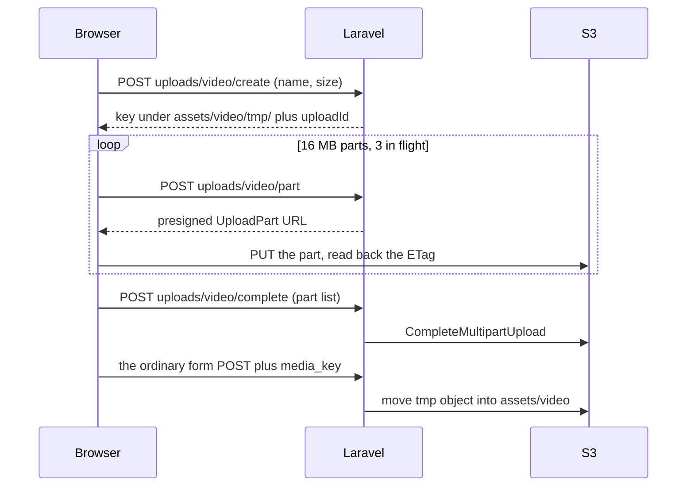

# Direct-to-S3 video upload — killing the 413

**Status:** implemented in app (presign endpoints, browser uploader, `adoptUploadedObject()`, six blades wired).
Ops must still apply the **bucket CORS rule** and the **tmp lifecycle rule** below, or every upload silently falls
back to the old in-form POST.

## The bug

Uploading a large podcast/webinar produced the toast **“Payload too large. Server dropped transaction.”** — the
`xhr.status === 413` branch in the create blades.

413 is emitted by **nginx `client_max_body_size 64M`** (README) or **PHP `post_max_size`**, *before* Laravel boots.
`uploadFile()` never ran, so nothing inside it could fix it. Raising the caps to 2 GB would only move the failure:
2 GB through PHP-FPM means tmp-disk churn, `max_execution_time`, `fastcgi_read_timeout`, and a return of the
`xhr.status === 0` problem documented in [PODCAST_UPLOAD_TIMEOUT.md](PODCAST_UPLOAD_TIMEOUT.md).

## The fix

The video no longer passes through nginx or PHP. The browser uploads it to S3 itself with presigned multipart URLs;
the form then posts a few hundred KB carrying only the object key.



**Ceiling: 2 GiB**, enforced in both `VideoUploadSignController::MAX_BYTES` and the JS.

### Pieces

| Piece | What it does |
|---|---|
| [`VideoUploadSignController`](../app/Http/Controllers/Admin/VideoUploadSignController.php) | `create` / `part` / `complete` / `abort`. Every route rejects a key outside `assets/video/tmp/`, so a caller cannot sign a write anywhere else. Extension and size are checked at `create`. |
| [`public/assets/js/direct-video-upload.js`](../public/assets/js/direct-video-upload.js) | `initDirectVideoUpload('#knowledgeForm')` binds **in front of** each form's existing submit handler, uploads the parts, then re-submits so the original handler posts as usual. |
| [`adoptUploadedObject()`](../app/helper.php) | Moves the tmp object into `assets/video/{time}-{rand}.{ext}` and deletes the previous one — same naming, cleanup and return value as `uploadFile()`. An S3-side copy; no bytes touch PHP. |
| Controllers | `store()`/`update()` on `KnowledgeBaseController`, `VideoUploadChildController`, `VideoMoreController` gained an `elseif ($request->filled('media_key'))` branch. |

### Nothing about the UI changed

Same forms, same fields, same button, same progress bar (the uploader drives `#upload-progress` / `#upload-bar` /
`#upload-percent`, exactly the elements each blade's own `showProgress()` uses), same toast copy.

### Failure always falls back to the old flow

If presigning 500s, a part PUT fails, CORS blocks the preflight, `ETag` is not exposed, or the browser lacks
`fetch`/`Promise`/`DataTransfer`, the uploader clears anything it staged and re-submits with the file still on the
form — i.e. **today’s behaviour and today’s toasts**, for files the old path could carry. Non-JS submits, the mobile
APIs and `uploadFile()` itself were not touched.

### Duration and thumbnail

The server has no local file to `ffprobe` on this path, so the browser reads `video.duration` and grabs a poster
frame from a `<canvas>`, posting them as `media_duration` and (only when the admin left the thumbnail blank) a
`thumbnail` file. Both are best-effort; the fallback is the `00:00` the app already tolerates.
`VideoMediaService::probe()` is unchanged and still serves the legacy in-form path.

## Ops — required

### 1. Bucket CORS

`ExposeHeaders: ETag` is **not optional**: multipart completion needs the per-part ETag, and without it the uploader
falls back to the old flow and the 413 returns.

```json
[
  {
    "AllowedOrigins": ["https://admin.empoweredhealth.asia"],
    "AllowedMethods": ["PUT", "POST", "GET", "HEAD"],
    "AllowedHeaders": ["*"],
    "ExposeHeaders": ["ETag"],
    "MaxAgeSeconds": 3000
  }
]
```

### 2. Lifecycle rule on the tmp prefix

Abandoned uploads otherwise accumulate as billable parts.

- Prefix `assets/video/tmp/` → expire current versions after **1 day**
- `AbortIncompleteMultipartUpload` after **1 day** (bucket-wide is fine)

### 3. IAM

The app's S3 identity needs `s3:PutObject`, `s3:GetObject`, `s3:DeleteObject`, `s3:AbortMultipartUpload`,
`s3:ListBucketMultipartUploads` and `s3:ListMultipartUploadParts` on the bucket.

### 4. nginx stays as it is

`client_max_body_size 64M` is still correct — only thumbnails and form fields flow through it now. Do **not** raise it
for this feature.

## Verifying on the server

Upload a ~1.5 GB mp4 on Parent Video Webinars → create. In the network panel the only requests to
`admin.empoweredhealth.asia` should be the four small signing calls plus the final form POST; the large PUTs go to
the bucket host. No 413, and the saved row plays back.
