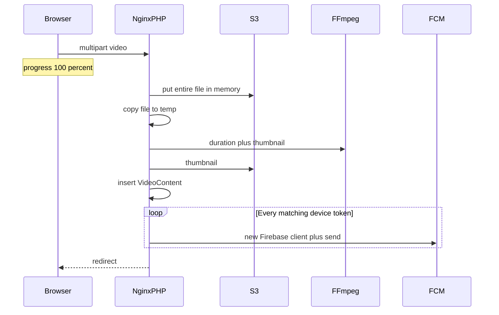

# Podcast / video upload — “Network timeout during data sync”

**Status:** implemented in app (stream S3, queued FCM, ffmpeg try/catch, AJAX JSON, toast copy). Ops still must apply nginx/PHP timeouts and run a queue worker on `admin.empoweredhealth.asia`.

**Superseded size note:** this document described a **64M** ceiling set by nginx `client_max_body_size` and PHP `post_max_size`, which surfaced as a **413 "Payload too large"**. Videos no longer pass through nginx or PHP at all — the browser uploads them directly to S3 and the ceiling is now **2 GiB**. See [`DIRECT_S3_UPLOAD.md`](DIRECT_S3_UPLOAD.md). Everything below still applies to the legacy in-form path, which remains the fallback.

---

## What the toast actually means

On Parent Video Webinars create ([`resources/views/admin/knowledge-base/create.blade.php`](../resources/views/admin/knowledge-base/create.blade.php)), the AJAX call sets **`timeout: 0`** (no client timer). The error path fires when **`xhr.status === 0`**. Copy is now:

```
Connection lost before the server responded. The file may be too large, or the server closed the request while processing.
```

Status `0` means the browser never got an HTTP response: idle timeout, PHP crash, connection reset, or abort. Same mapping on child webinars and video-other create/edit.

A 504 would show “Upstream processing gateway timed out.” A 413 would show payload-too-large. This is **not** Laravel validation and **not** the nginx 64M body limit (those would be 413).

Typical sequence before the app fix: progress hits **100%** (“File received by the server…”) then the toast fires. Upload finished; **post-upload work** is what died.

---

## Why the request died after 100% (pre-fix)

[`KnowledgeBaseController::store`](../app/Http/Controllers/KnowledgeBaseController.php) did all of this **inside one HTTP request**:



Bottlenecks:

1. **S3 loaded the whole video into RAM** — `Storage::disk('s3')->put($path, file_get_contents($file))`. A 50–64 MB file plus PHP overhead could hit `memory_limit`, fatal the worker, and leave the browser with status `0`.
2. **Second full disk copy** for FFmpeg, then `FFProbe` + `FFMpeg` frame extract. Missing/slow binaries hung until PHP/`fastcgi_read_timeout` killed the socket.
3. **Push notifications on the same request** — after save, all matching device tokens and `sendNotificationSender` in a loop. That helper **creates a new Firebase `Factory` + messaging client per user**. Hundreds of parents exceed typical **60s** nginx/ALB idle timeouts even if the file already landed.

README nginx only used to set `client_max_body_size 64M`; it did **not** raise `fastcgi_read_timeout` (default **60s**). PHP `max_execution_time` is often **30s**. Either drops the connection with status `0`.

The controller also **`return redirect(...)`** while the form asks for `Accept: application/json`. Success path was a 302 HTML page.

---

## What changed in this repo

Keep the existing create/edit UI and routes. Mobile APIs unchanged.

- [`uploadFile()`](../app/helper.php) streams with `Storage::disk('s3')->putFileAs` (no `file_get_contents`).
- After save, [`NotifyVideoContentAudience`](../app/Jobs/NotifyVideoContentAudience.php) is dispatched (KnowledgeBase, child webinars, video-other store; same pattern on parent/child update).
- [`VideoMediaService::probe`](../app/Services/VideoMediaService.php) wraps FFProbe/FFMpeg in try/catch with a 30s binary timeout. Failures keep duration `00:00` and still save the row.
- AJAX store/update returns `{ ok, redirect, message }` via [`RespondsToVideoUpload`](../app/Http/Controllers/Concerns/RespondsToVideoUpload.php). Blades use `res.redirect` / `res.message`.
- Status-`0` toast copy as above.

---

## Server (ops)

On `admin.empoweredhealth.asia` apply README nginx `fastcgi_read_timeout` / `fastcgi_send_timeout` **300s**, PHP `upload_max_filesize` / `post_max_size` **64M**, `max_execution_time` **300**. Raise ALB/proxy idle timeout if something sits in front of nginx.

**Queue:** FCM still runs synchronously if `QUEUE_CONNECTION=sync`. Production must use `database` or `redis` plus `php artisan queue:work` (or supervisor). Without a worker, notifications never send; with `sync`, the original timeout can return when parent count grows.

Without the queue + stream upload, raising timeouts only delays the same failure.

---

## Out of scope

- Raising the 64M nginx cap unless product wants larger files.
- School-roster / subscription work (separate).
